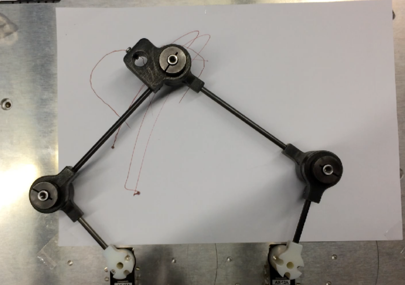
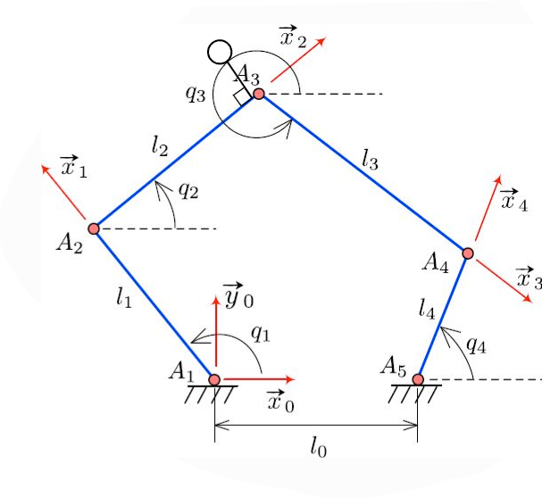

**********
Maquette
**********

La maquette utilisée lors de ce projet est réprésentée sur la figure ci-dessous. 

On peut retrouver le schéma cinématique correspondant : 

Paramètres du système
====================
.. raw:: html

   

.. math::

   L_0 = \overline{A_1A_5} = 137.98 \, \text{mm} \\
   L_1 = \overline{A_1A_2} = 80 \, \text{mm} \\
   L_2 = \overline{A_2A_3} = 146.3 \, \text{mm} \\
   L_3 = \overline{A_3A_4} = 146.3 \, \text{mm} \\
   L_4 = \overline{A_4A_5} = 80 \, \text{mm}

.. raw:: html

   

.. note::
   Attention au décalage du support du stylo à prendre en compte.

   Seules les articulations A_1 et A_5 sont motorisées