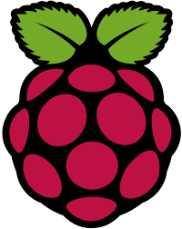

*********
Rasberry
*********

Présentation du Raspberry Pi
============================

Le **Raspberry Pi** est un ordinateur monocarte compact, abordable et polyvalent. Conçu initialement pour l'éducation, il est devenu un outil de prédilection pour les amateurs de technologies, les enseignants et les professionnels. Voici une présentation de ses principales caractéristiques et applications.

---

1. Qu'est-ce qu'un Raspberry Pi ?
---------------------------------

Le Raspberry Pi est une série de petits ordinateurs développés par la **Raspberry Pi Foundation**. Il offre des capacités de traitement similaires à celles d'un ordinateur standard, tout en étant à la portée de tous grâce à son prix attractif.

Pour en savoir plus sur la Raspberry Pi Foundation, consultez leur site officiel : `raspberrypi.org <https://www.raspberrypi.org>`_.

---

2. Les principaux modèles de Raspberry Pi
------------------------------------------

Les modèles les plus populaires incluent :

- **Raspberry Pi 4** : Idéal pour des applications exigeantes comme le multimédia ou les serveurs.
- **Raspberry Pi 3** : Bien adapté aux projets IoT et à l'apprentissage.
- **Raspberry Pi Zero** : Ultra-compact et parfait pour les projets embarqués.

Pour une comparaison complète des modèles disponibles, vous pouvez visiter : `Comparatif des modèles Raspberry Pi <https://www.raspberrypi.org/documentation/computers/>`_.

---

3. Applications courantes
--------------------------

Les possibilités avec un Raspberry Pi sont infinies. Voici quelques exemples d'applications :

a) **Apprentissage de la programmation**

Le Raspberry Pi est souvent utilisé pour enseigner les bases de la programmation en langages comme Python et Scratch.

b) **Serveurs personnels**

Avec un Raspberry Pi, vous pouvez créer :
- Un serveur web.
- Un serveur multimédia (comme Plex ou Kodi).
- Un cloud personnel (comme NextCloud).

c) **Domotique**

Il peut être utilisé pour contrôler des appareils connectés chez vous (lumières, caméras, thermostats).

d) **Projets créatifs et IoT**

Des robots aux stations météo, en passant par l'impression 3D, le Raspberry Pi est au cœur de nombreux projets DIY.

Pour explorer des tutoriels inspirants, rendez-vous sur : `Projets Raspberry Pi <https://projects.raspberrypi.org>`_.

---

4. Pourquoi utiliser un Raspberry Pi avec VSCode ?
---------------------------------------------------

VSCode est un outil puissant pour :

- Éditer et déboguer du code sur le Raspberry Pi.
- Travailler sur des projets en Python, Node.js ou d'autres langages.
- Se connecter à distance au Raspberry Pi via SSH grâce à des extensions comme **Remote - SSH**.

Pour une configuration rapide de VSCode avec un Raspberry Pi, consultez ce guide officiel : `Documentation VSCode Remote <https://code.visualstudio.com/docs/remote/remote-overview>`_.

---

En conclusion, le Raspberry Pi est un outil incontournable pour tout passionné de technologies. Intégré à votre flux de travail avec VSCode, il offre une expérience de développement fluide et à faible coût.
