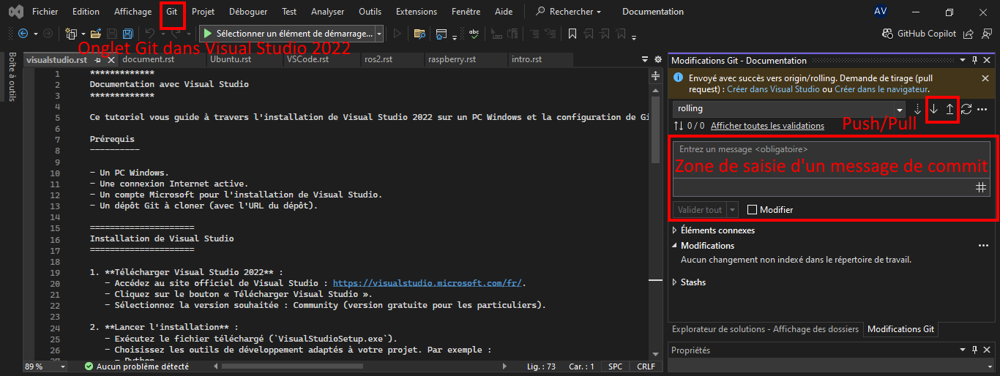

*************
Documentation avec Visual Studio
*************

Ce tutoriel vous guide à travers l'installation de Visual Studio 2022 sur un PC Windows et la configuration de Git dans Visual Studio pour cloner un dépôt.

Prérequis
----------

<<<<<<< HEAD
- Un PC Windows.
- Une connexion Internet active.
- Un compte Microsoft pour l'installation de Visual Studio.
- Un dépôt Git à cloner (avec l'URL du dépôt).
=======
* Un PC Windows.
* Une connexion Internet active.
* Un compte Microsoft pour l'installation de Visual Studio.
* Un dépôt Git à cloner (avec l'URL du dépôt).
>>>>>>> 5f3ac4a06bb4552341999b00518f2ae20812a29e

=====================
Installation de Visual Studio
=====================

<<<<<<< HEAD
1. **Télécharger Visual Studio 2022** :
   - Accèdez au site officiel de Visual Studio : https://visualstudio.microsoft.com/fr/.
   - Cliquez sur le bouton à Télécharger Visual Studio �.
   - Sélectionnez la version souhaitée : Community (version gratuite pour les particuliers).
=======
1. **Télécharger Visual Studio 2022** :
   * Accédez au site officiel de Visual Studio : https://visualstudio.microsoft.com/fr/.
   * Cliquez sur le bouton "Télécharger Visual Studio".
   * Sélectionnez la version souhaitée : Community (version gratuite pour les particuliers).
>>>>>>> 5f3ac4a06bb4552341999b00518f2ae20812a29e

2. **Lancer l'installation** :
<<<<<<< HEAD
   - Exécutez le fichier téléchargé (`VisualStudioSetup.exe`).
   - Choisissez les outils de développement adaptés à votre projet. Par exemple : 
     - Python.
     - "Développement avec .NET".
     - "Développement multiplateforme avec C++".
   - Cliquez sur "Installer" pour lancer le processus.
=======
   * Exécutez le fichier téléchargé (`VisualStudioSetup.exe`).
   * Choisissez les outils de développement adaptés à votre projet. Par exemple : 
     * Python.
     * "Développement avec .NET".
     * "Développement multiplateforme avec C++".
   * Cliquez sur "Installer" pour lancer le processus.
>>>>>>> 5f3ac4a06bb4552341999b00518f2ae20812a29e

.. warning::
    Visual Studio est un logiciel assez volumineux, veillez à ne cocher que les environnements de développement donc vous avez besoin pour éviter de prendre trop de volume sur votre ordinateur.

3. **Configuration initiale** :
<<<<<<< HEAD
   - Une fois l'installation terminée, ouvrez Visual Studio.
   - Connectez-vous avec votre compte Microsoft si demandé.
=======
   * Une fois l'installation terminée, ouvrez Visual Studio.
   * Connectez-vous avec votre compte Microsoft si demandé.
>>>>>>> 5f3ac4a06bb4552341999b00518f2ae20812a29e

=====================
Git dans Visual Studio
=====================

<<<<<<< HEAD
1. **Vérifier que Git est installé** :
   - Visual Studio inclut un client Git intégré.
=======
1. **V�rifier que Git est install�** :
   * Visual Studio inclut un client Git int�gr�.
>>>>>>> 5f3ac4a06bb4552341999b00518f2ae20812a29e

<<<<<<< HEAD
2. **Configurer les paramètres Git** :
   - Ouvrez Visual Studio.
   - Allez dans "Outils" > "Options".
   - Naviguez vers "Contrôle de source" > "Paramètres globaux Git".
   - Configurez les informations suivantes :
     - **Nom d'utilisateur** : Votre nom pour les commits Git.
     - **Adresse e-mail** : L'adresse e-mail associée à votre compte Git.
=======
2. **Configurer les param�tres Git** :
   * Ouvrez Visual Studio.
   * Allez dans � Outils � > � Options �.
   * Naviguez vers � Contr�le de source � > � Param�tres globaux Git �.
   * Configurez les informations suivantes :
     * **Nom d�utilisateur** : Votre nom pour les commits Git.
     * **Adresse e-mail** : L�adresse e-mail associ�e � votre compte Git.
>>>>>>> 5f3ac4a06bb4552341999b00518f2ae20812a29e

<<<<<<< HEAD
3. **Cloner un dépôt Git** :
   - Cliquez sur "Git" dans la barre d'outils principale de Visual Studio.
   - Sélectionnez "Cloner un dépôt".
   - Collez l'URL du dépôt Git que vous souhaitez cloner.
   - Sélectionnez le répertoire local où les fichiers seront enregistrés.
   - Cliquez sur "Cloner".
   - Une fois le dépôt cloné, il sera visible dans l'explorateur de solutions de Visual Studio (onglet à droite)
=======
3. **Cloner un d�p�t Git** :
   * Cliquez sur � Git � dans la barre d'outils principale de Visual Studio.
   * S�lectionnez � Cloner un d�p�t �.
   * Collez l�URL du d�p�t Git que vous souhaitez cloner.
   * S�lectionnez le r�pertoire local o� les fichiers seront enregistr�s.
   * Cliquez sur � Cloner �.
   * Une fois le d�p�t clon�, il sera visible dans l�explorateur de solutions de Visual Studio (onglet � droite)
>>>>>>> 5f3ac4a06bb4552341999b00518f2ae20812a29e

=====================
Modifications du code hébergé sur Git
=====================

1. **Effectuer un commit local** :
<<<<<<< HEAD
   - Modifiez un fichier dans le projet cloné.
   - Cliquez sur "Git" dans la barre d'outils principale de Visual Studio.
   - Ajoutez un message de commit et cliquez sur "Commit".
=======
   * Modifiez un fichier dans le projet clon�.
   * Cliquez sur � Git � dans la barre d'outils principale de Visual Studio.
   * Ajoutez un message de commit et cliquez sur � Commit �.
>>>>>>> 5f3ac4a06bb4552341999b00518f2ae20812a29e

2. **Pousser les changements** :
<<<<<<< HEAD
   - Cliquez sur "Pousser" pour envoyer les changements vers le dépôt distant.
=======
   * Cliquez sur � Pousser � pour envoyer les changements vers le d�p�t distant.
>>>>>>> 5f3ac4a06bb4552341999b00518f2ae20812a29e

